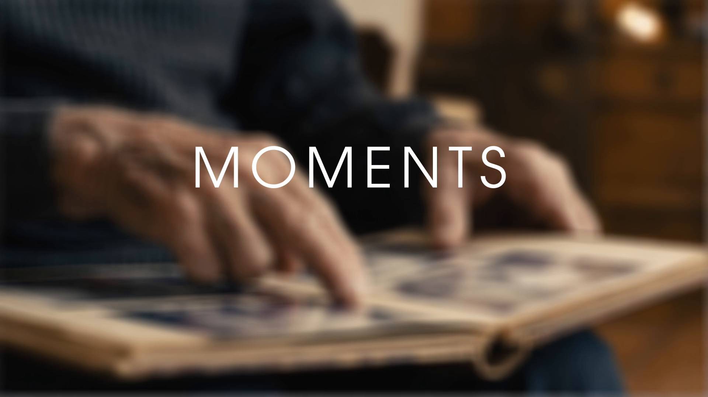
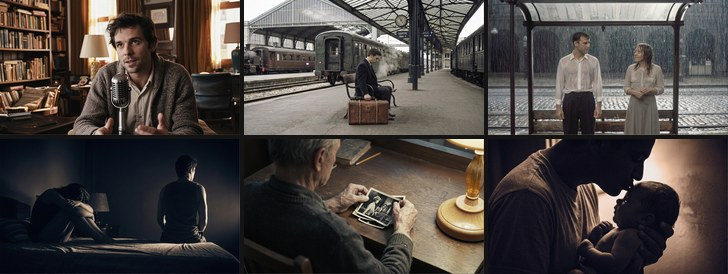

# MOMENTS — Making of

*2026-03-30*

Lately I've been watching a lot of podcasts. Scientists, philosophers, that kind of thing. Neil deGrasse Tyson is a big favorite for me. At some point I thought — I want to make something like this. Just a short video, one idea, one voice talking directly to camera.

Then the ArcaGidan challenge came out with the theme of Time, and that was the trigger. The first thing that popped into my head was that old saying — it's not the destination, it's the journey. I kept thinking about it. The journey isn't just the road... It's made of specific moments. The ones where things actually changed. Where you went one way instead of another, whether you chose it or not.

And that's when a quote I'd known for years suddenly fit perfectly — Soren Kierkegaard: "Life can only be understood backwards; but it must be lived forwards." You're in the middle of something and you have no idea what it is yet. You only get it years later, when something random throws you right back there.

Those things together became MOMENTS: a ~2-minute short film about the pivot points of a life.

---

## Preview

Watch the full short-film here: *(link coming soon)*

If you like it, please vote — that's the best way to support this kind of work and help me keep making more opensource stuff: new workflows, fine-tuned models (full finetune, LoRA, IC-LoRA...), and so on.

---

## Building the Pipeline

The basic flow was: write the script → write the prompts → generate a key frames → animate them → fix the face → upscale → add voice → add music → cut it together.

### Narration: VibeVoice

I didn't want something that obviously sounds like AI. I needed a voice that felt like someone actually sitting there and talking. I used [VibeVoice](../../) with a cloned voice based on P.J. Taylor from LibriVox ([reader 9165](https://librivox.org/reader/9165)). 

### Key-frames: Two-Stage T2I → I2V

So what I do is: first I generate one or more still image, get them looking exactly how I want it, then use those images for the videos. That's it basically.

If I need key-frames for specific shots, I take the base image and manipulate it with an image-edit model like Qwen-Image-Edit or Nanobanana. 

For the stills I used [Z-Image Two-Stage](../../z-image/two-stage/) — it does two passes, the second one at low denoise to clean up details.

### Animation: Image-to-Video

I tried a lot of different workflows and settings for I2V. Still can't say I've figured it out — every project feels like I'm half-guessing. But here's one I put together that worked well for this film: *(workflow coming soon)*

The key-frames go in and the video prompt only describes motion, nothing visual. The visuals are already in the image.

### Face Detailing: WAN 2.2

LTX 2.3 has a lot of artifacts, especially on smaller details — faces, hands, fine textures. It's just how it is. F

So I made a WAN 2.2 based detailer workflow for this. It segments the face - or anything else you want actually - with SAM2, crops it out, runs a WAN 2.2 pass on just that region, then puts it back into the original video. The rest of the clip stays untouched.

The workflow is here: [WAN 2.2 Face Detailer](../../wan/2.2/face-detailer/)

 

### Music: Suno

The prompt I used:

> Minimalist ambient bed for spoken word; slowly evolving piano clusters over warm synth swells and distant reversed textures. Very soft sidechained pads breathe around the voice, with subtle granular noise drifting in and out. Energy stays low and steady, occasionally blooming into gentle chords before receding, perfect for underscoring intimate storytelling, emotional.

Suno did well with this.

### Editing: Kdenlive

Nothing fancy here. The script was written with the cuts already in mind, so putting it together in Kdenlive was mostly just mechanical assembly.

### Tools at a glance

| Role            | Tool / Workflow                                               |
| --------------- | ------------------------------------------------------------- |
| Music           | Suno                                                          |
| TTS             | VibeVoice — cloned voice (P.J. Taylor / LibriVox reader 9165) |
| Image/Video gen | ComfyUI                                                       |
| Image-to-Video  |                         |
| Text-to-Image   | [Z-Image Two-Stage](../../z-image/two-stage/)                 |
| Image editing   | Qwen-Image / Nanobanana                                       |
| Face detailing  | [WAN 2.2 Face Detailer](../../wan/2.2/face-detailer/)         |
| Video editing   | Kdenlive                                                      |

---

## Changelog

- `2026-03-30` — Published
